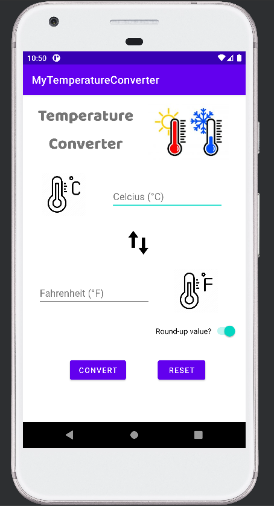

# Temperature-Converter

## About
This project is part of an activity in my Mobile Development course. This mobile application is based on Kotlin and function as Temperature Converter. Specifically, it converts temperature from Celsius to Fahrenheit and vice versa. The mobile app utilizes text for displaying labels and output, text edit for inputs, buttons to convert the input value, and switch for rounding off the converted value.

## Project Demo

